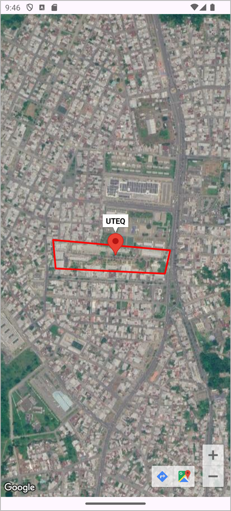

# App7 — Google Maps: Vista Satelital, Marcador y Polilínea


-----

|Campo      |Detalle                                              |
|-----------|-----------------------------------------------------|
|Universidad|Universidad Técnica Estatal de Quevedo (UTEQ)        |
|Facultad   |Facultad de Ciencias de la Computación (FCC)         |
|Carrera    |Software                                             |
|Materia    |Aplicaciones Móviles — SOFT-R-A · 6to Nivel · Corte 2|
|Tema       |Google Maps SDK para Android                         |
|Estudiante |Eduardo Reinoso Vélez                               |

-----

## Objetivo

Integrar el SDK de Google Maps para Android en una aplicación Java nativa, mostrando la ubicación del campus de la UTEQ en vista satelital mediante un `SupportMapFragment`. La aplicación posiciona la cámara sobre las coordenadas del recinto, añade un marcador con la etiqueta *UTEQ* y traza una polilínea cerrada de color rojo que delimita el perímetro del campus.

-----

## Tecnologías

|Tecnología / Herramienta|Versión|Propósito                                                 |
|------------------------|-------|----------------------------------------------------------|
|Java                    |11     |Lenguaje principal                                        |
|Android SDK             |API 24–36|Plataforma de ejecución                                 |
|Google Maps SDK         |18.2.0 |Renderizado del mapa, marcadores y polilíneas             |
|Play Services Location  |21.3.0 |Permisos de ubicación (`ACCESS_FINE_LOCATION`)            |
|Activity KTX            |1.13.0 |Soporte Edge-to-Edge y manejo de window insets            |
|ConstraintLayout        |2.2.1  |Layout base de la actividad                               |
|Material Components     |1.14.0 |Tema base de la aplicación                                |
|Gradle (Groovy DSL)     |9.2.1  |Sistema de construcción con catálogo de versiones (TOML)  |
|Android Studio Panda    |4.x    |IDE de desarrollo                                         |

-----

## Arquitectura

La aplicación sigue un patrón de **Single Activity** donde `MainActivity` implementa `OnMapReadyCallback` para recibir la instancia del mapa una vez inicializado. El `SupportMapFragment` se declara directamente en el layout XML y su ciclo de vida es gestionado por el `FragmentManager`.

```
MainActivity (AppCompatActivity + OnMapReadyCallback)
├── onCreate()
│   ├── EdgeToEdge.enable()               ← modo pantalla completa
│   ├── setContentView(activity_main.xml)
│   └── SupportMapFragment.getMapAsync()  ← carga asíncrona del mapa
└── onMapReady(GoogleMap)
    ├── MAP_TYPE_SATELLITE                 ← vista satelital
    ├── UiSettings.setZoomControlsEnabled(true)
    ├── CameraUpdateFactory.newLatLngZoom(-1.0125, -79.4693, zoom=17)
    ├── PolylineOptions (5 vértices, rojo, ancho 8px)
    │   ← polilínea cerrada sobre el perímetro del campus
    └── MarkerOptions(LatLng(-1.0125, -79.4693), title="UTEQ")
```

-----

## Estructura del proyecto

```
App7/
├── app/
│   ├── src/
│   │   └── main/
│   │       ├── java/com/example/app7/
│   │       │   └── MainActivity.java
│   │       ├── res/
│   │       │   ├── layout/
│   │       │   │   └── activity_main.xml     # ConstraintLayout + SupportMapFragment
│   │       │   └── values/
│   │       │       ├── strings.xml
│   │       │       └── themes.xml
│   │       └── AndroidManifest.xml           # API key + permisos de ubicación
│   └── build.gradle
├── gradle/
│   └── libs.versions.toml                    # Catálogo central de versiones
├── build.gradle
└── settings.gradle
```

-----

## Funcionalidades implementadas

Al iniciar la aplicación el mapa se carga en modo satelital centrado en las coordenadas `-1.0125, -79.4693` (campus UTEQ, Quevedo) con nivel de zoom 17. Los controles de zoom se habilitan mediante `UiSettings`. Se dibuja una polilínea cerrada con cinco vértices que recorre el contorno rectangular del recinto universitario, configurada con color rojo (`Color.RED`) y grosor de 8 píxeles. Sobre el centroide del campus se agrega un marcador cuya ventana emergente muestra el texto *UTEQ* al pulsarlo. El permiso `ACCESS_FINE_LOCATION` está declarado en el manifiesto junto con `ACCESS_COARSE_LOCATION` e `INTERNET`, requeridos por el SDK.

-----

## Instalación y ejecución

**Requisitos previos:** Android Studio Panda 4, JDK 11, dispositivo o emulador con API 24+, cuenta en [Google Cloud Console](https://console.cloud.google.com/) con la API *Maps SDK for Android* habilitada.

1. Clonar el repositorio:

   ```bash
   git clone https://github.com/ereinosov/App7.git
   ```

1. Abrir la carpeta `App7/` en Android Studio.

1. En `app/src/main/AndroidManifest.xml`, reemplazar el valor vacío del meta-dato `com.google.android.geo.API_KEY` con la clave obtenida de Google Cloud Console:

   ```xml
   <meta-data
       android:name="com.google.android.geo.API_KEY"
       android:value="TU_API_KEY_AQUI" />
   ```

1. Sincronizar Gradle desde **File → Sync Project with Gradle Files**.

1. Ejecutar con **Run → Run 'app'** (`Shift + F10`) sobre un dispositivo o emulador con Google Play Services instalado.

> La API key no debe subirse al repositorio. Se recomienda añadir el valor a `local.properties` e inyectarlo en tiempo de compilación mediante el [Secrets Gradle Plugin for Android](https://github.com/google/secrets-gradle-plugin).

-----

## Dependencias principales

```groovy
// app/build.gradle — vía catálogo de versiones (libs.versions.toml)
dependencies {
    implementation libs.play.services.maps      // com.google.android.gms:play-services-maps:18.2.0
    implementation libs.play.services.location  // com.google.android.gms:play-services-location:21.3.0
    implementation libs.activity.ktx            // androidx.activity:activity-ktx:1.13.0
    implementation libs.appcompat               // androidx.appcompat:appcompat:1.7.1
    implementation libs.constraintlayout        // androidx.constraintlayout:constraintlayout:2.2.1
    implementation libs.material                // com.google.android.material:material:1.14.0
}
```

-----

## Capturas de pantalla



-----


-----

*Universidad Técnica Estatal de Quevedo · FCC · Carrera Software · 2026*
